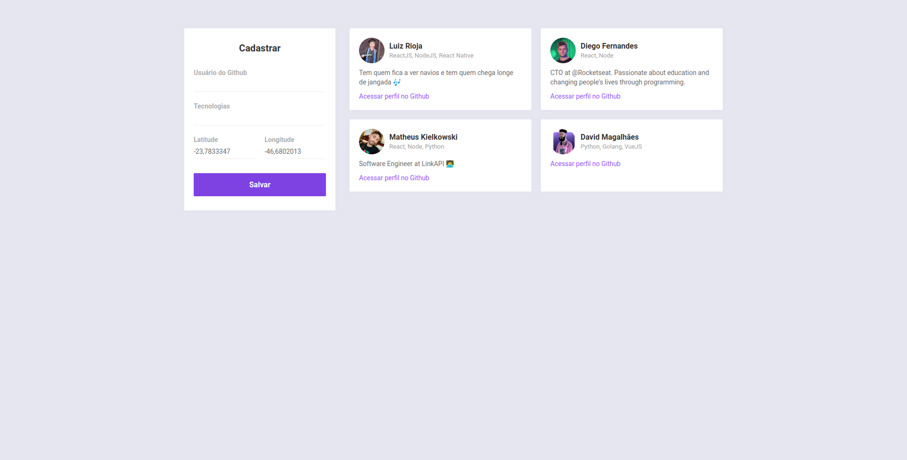
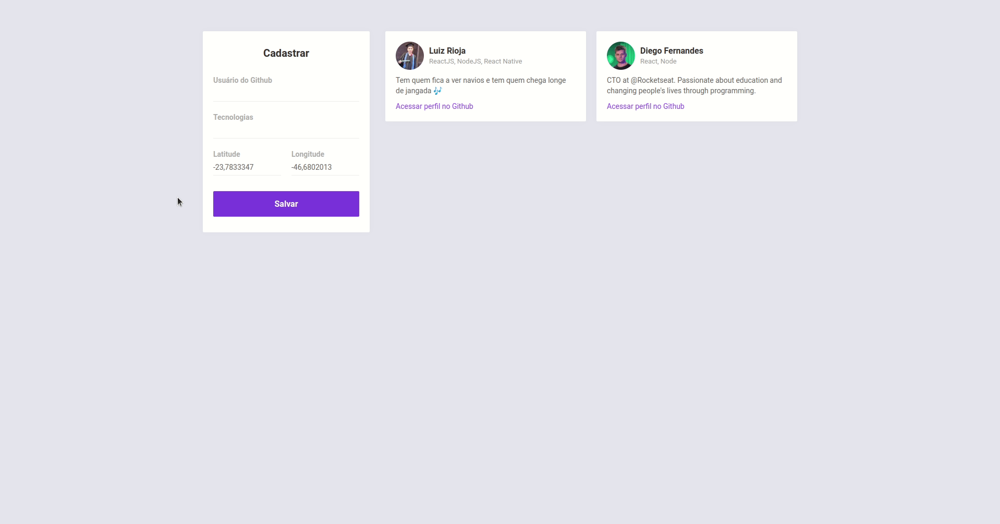
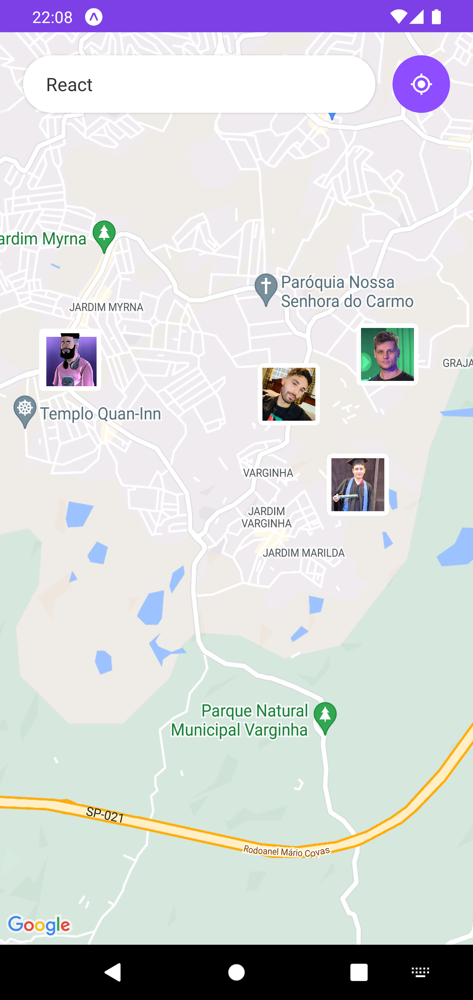
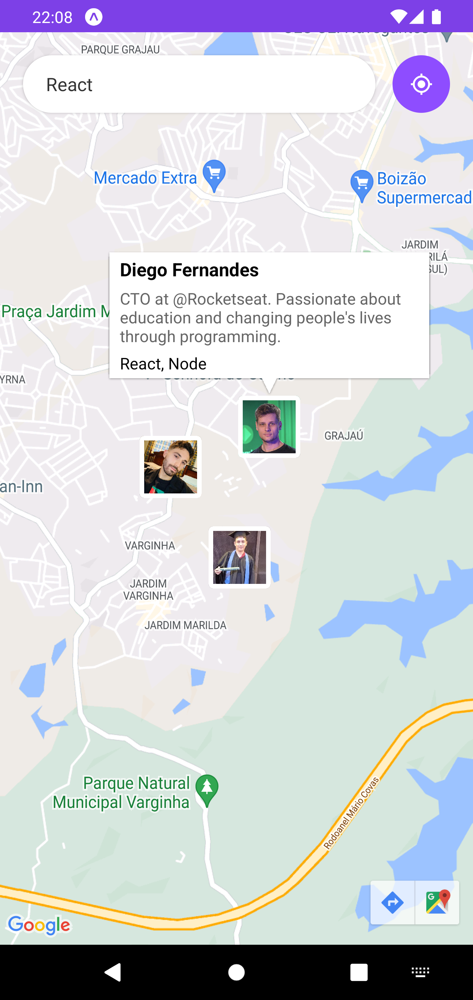
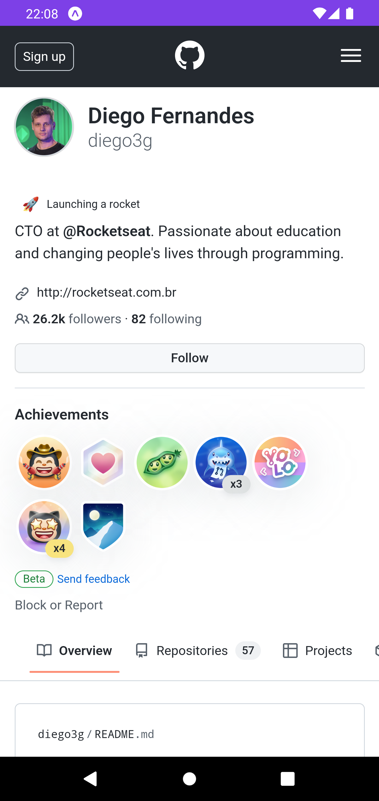

<p align="center">
  
</p>
<h3 align="center">
  Seu novo projeto começa aqui!
</h3>

<p align="center">
  
  
  
  
</p>
<br>

<p align="center">
  <a href="#sobre">Sobre</a> •
  <a href="#dev-radar">Dev Radar</a> •
  <a href="#instalação">Instalação</a> •
  <a href="#tecnologias">Tecnologias</a> •
  <a href="#autor">Autor</a>  
</p>

## Sobre

Projeto desenvolvido durante a <strong>Semana OmniStack 10</strong>, evento criado pela <strong><a href="https://rocketseat.com.br/">Rocketseat</a></strong>.  
 Um evento 100% online e GRATUITO, com conteúdo exclusivo e INÉDITO.

Ocorreu do dia 13 ao dia 17 de Janeiro de 2020 e teve como intuito mostrar na prática o poder da stack
<strong><a href="https://nodejs.org/pt-br/">NodeJS</a></strong> +
<strong><a href="https://pt-br.reactjs.org/">ReactJS</a></strong> +
<strong><a href="https://reactnative.dev">React Native</a></strong> e como essas tecnologias podem te levar até os seus maiores objetivos como programador.


## Dev Radar

O Dev Radar é uma aplicação para buscar desenvolvedores por stack baseado na localização atual do usuário. O proposito é simples: o usuário busca por uma tecnologia e a aplicação irá informar outros devs num raio de 10KM que trabalham com a respectiva tecnologia.
A aplicação possui duas partes sendo elas a aplicação web e o app mobile, as quais serão mostras e explicadas nos próximos tópicos.

### Aplicação web

A aplicação web tem como função ser a interface de cadastro dos usuários. A interface é simples e possui à esquerda um formulário para preenchimento dos dados e à direita a lista dos usuários já cadastrados, conforme vemos a seguir:



Ao acessar a página será solicitado a permissão para acessar a localização do usuário, sendo ela concedida, automaticamente os dados de latitude e longitude do usuário serão inseridos no formulário.

A seguir temos uma demonstração da página web em funcionamento aonde fazemos o cadastro de um novo desenvolvedor:



### Aplicação mobile

O objetivo do app mobile é servir para realizar a busca de devs por tecnologia desejada. Ao acessar o aplicativo, o usuário irá se deparar com a tela abaixo aonde terá um campo para inserir a tecnologia que deseja buscar e um mapa aonde o pin dos devs serão inseridos revelando suas respectivas localizações:



Ao clicar na marcação de um dev, uma breve descrição dele será exibida, contendo seu nome, bio do Github e as tecnologias com que ele trabalha:



Ao clicar na biografia do desenvolvedor, o usuário será direcionado para o perfil dele no Github aonde poderá segui-lo, ver seus projetos e explorar outras informações à respeito dele:



Abaixo temos uma demonstração do aplicativo em funcionamento:


## Instalação

Antes de começar, você vai precisar ter instalado em sua máquina as seguintes ferramentas:
[Git](https://git-scm.com), [Node.js](https://nodejs.org/en/).
Além disso é bom ter um editor para trabalhar com o código como [VSCode](https://code.visualstudio.com/).

### 🎲 Rodando o Back End (servidor)

```bash
# Clone este repositório
$ git clone git@github.com:MrRioja/OmniStack-10.git

# Acesse a pasta do projeto no terminal/cmd
$ cd OmniStack-10

# Vá para a pasta server
$ cd Backend

# Instale as dependências
$ npm install
# Caso prefira usar o Yarn execute o comando abaixo
$ yarn

# Execute a aplicação em modo de desenvolvimento
$ npm run dev
# Caso prefira usar o Yarn execute o comando abaixo
$ yarn dev

# O servidor inciará na porta 3333 - acesse <http://localhost:3333>
```

### 🖥️ Rodando o Front End (Web)

```bash
# Clone este repositório
$ git clone git@github.com:MrRioja/OmniStack-10.git

# Acesse a pasta do projeto no terminal/cmd
$ cd OmniStack-10

# Vá para a pasta server
$ cd web

# Instale as dependências
$ npm install
# Caso prefira usar o Yarn execute o comando abaixo
$ yarn

# Execute a aplicação em modo de desenvolvimento
$ npm run start
# Caso prefira usar o Yarn execute o comando abaixo
$ yarn start

# O servidor inciará na porta 3000 - acesse <http://localhost:3000>
```

### 📱 Rodando o App (Mobile)

```bash
# Clone este repositório
$ git clone git@github.com:MrRioja/OmniStack-10.git

# Acesse a pasta do projeto no terminal/cmd
$ cd OmniStack-10

# Vá para a pasta server
$ cd mobile

# Instale as dependências
$ npm install
# Caso prefira usar o Yarn execute o comando abaixo
$ yarn

# Execute a aplicação
$ expo start

# Será aberto no terminal o menu do Expo onde poderá scanear o QR Code para executar o app diretamente no seu celular ou as opções de executar no emulador android ou iOS
```

## Tecnologias


<br><br><br><br>

## Autor

<div align="center">

<h1>Luiz Rioja</h1>
<strong>Backend Developer</strong>
<br/>
<br/>

<a href="https://linkedin.com/in/luizrioja" target="_blank">

</a>

<a href="https://github.com/mrrioja" target="_blank">

</a>

<a href="mailto:lulyrioja@gmail.com?subject=Fala%20Dev" target="_blank">

</a>

<a href="https://api.whatsapp.com/send?phone=5511933572652" target="_blank">

</a>

<a href="https://join.skype.com/invite/tvBbOq03j5Uu" target="_blank">

</a>

<br/>
<br/>
</div>
